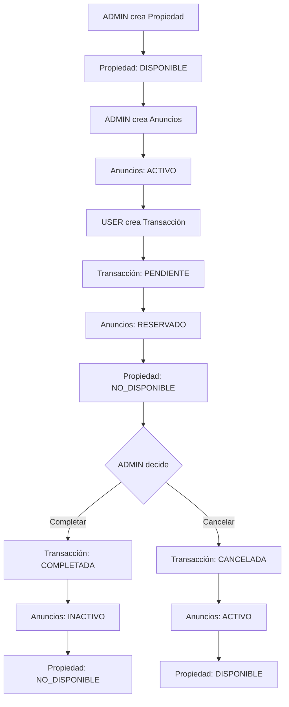

# Red Atlas Express API

[](https://github.com/your-org/red-atlas-express)
[](./coverage)
[](https://www.typescriptlang.org/)
[](./LICENSE)

## Overview

Red Atlas Express es una API REST robusta para gestión de propiedades inmobiliarias, desarrollada con TypeScript, Express, TypeORM y PostgreSQL con PostGIS. El sistema maneja el ciclo completo de transacciones inmobiliarias desde la creación de propiedades hasta la finalización de operaciones comerciales.

### Características Principales

- **Multi-tenant**: Aislamiento completo de datos por inquilino
- **Geoespacial**: Búsquedas por proximidad con PostGIS
- **Cache inteligente**: Redis con invalidación automática
- **Autenticación JWT**: Tokens de acceso y refresh
- **Paginación cursor-based**: Escalable para grandes datasets
- **Testing completo**: Unitarios y performance

### Arquitectura

```
┌─────────────────┐    ┌─────────────────┐    ┌─────────────────┐
│   Controllers   │───▶│    Services     │───▶│  Repositories   │
│  (HTTP Layer)   │    │ (Business Logic)│    │  (Data Access)  │
└─────────────────┘    └─────────────────┘    └─────────────────┘
         │                       │                       │
         ▼                       ▼                       ▼
┌─────────────────┐    ┌─────────────────┐    ┌─────────────────┐
│   Middlewares   │    │  Cache Service  │    │   PostgreSQL    │
│ (Auth, Errors)  │    │     (Redis)     │    │   + PostGIS     │
└─────────────────┘    └─────────────────┘    └─────────────────┘
```


## Flujo de Negocio

### Entidades y Roles

**Entidades principales:**
- **Propiedades**: Inmuebles con ubicación geoespacial
- **Anuncios**: Ofertas de venta/alquiler sobre propiedades
- **Transacciones**: Operaciones comerciales entre usuarios

**Roles del sistema:**
- **ADMIN**: Gestiona propiedades y anuncios, controla transacciones
- **USER**: Crea transacciones sobre anuncios disponibles

### Ciclo de Estados



### Reglas de Estado

1. **Creación de Transacción (USER)**:
   - Transacción → `PENDIENTE`
   - Todos los anuncios de la propiedad → `RESERVADO`
   - Propiedad → `NO_DISPONIBLE`

2. **Completar Transacción (ADMIN)**:
   - Transacción → `COMPLETADA`
   - Todos los anuncios → `INACTIVO`
   - Propiedad permanece `NO_DISPONIBLE`

3. **Cancelar Transacción (ADMIN)**:
   - Transacción → `CANCELADA`
   - Todos los anuncios → `ACTIVO`
   - Propiedad → `DISPONIBLE`

## Requisitos Previos

| Herramienta | Versión Mínima | Propósito |
|-------------|----------------|-----------|
| Node.js | 18.x | Runtime de JavaScript |
| npm | 9.x | Gestor de paquetes |
| Docker | 20.x | Contenedores |
| Docker Compose | 2.x | Orquestación |
| PostgreSQL | 14.x | Base de datos principal |
| PostGIS | 3.3.x | Extensión geoespacial |
| Redis | 7.x | Cache y sesiones |

## Configuración

### Variables de Entorno

| Variable | Descripción | Obligatoria | Ejemplo |
|----------|-------------|-------------|---------|
| `NODE_ENV` | Entorno de ejecución | ✅ | `development` |
| `PORT` | Puerto del servidor | ✅ | `3000` |
| `DB_HOST` | Host de PostgreSQL | ✅ | `localhost` |
| `DB_PORT` | Puerto de PostgreSQL | ✅ | `5432` |
| `DB_USERNAME` | Usuario de base de datos | ✅ | `postgres` |
| `DB_PASSWORD` | Contraseña de base de datos | ✅ | `password` |
| `DB_NAME` | Nombre de la base de datos | ✅ | `red_atlas_db` |
| `JWT_SECRET` | Clave secreta para JWT | ✅ | `your-secret-key` |
| `JWT_EXPIRES_IN` | Expiración del token | ✅ | `15m` |
| `REFRESH_TOKEN_SECRET` | Clave para refresh tokens | ✅ | `your-refresh-secret` |
| `REFRESH_TOKEN_EXPIRES_IN` | Expiración refresh token | ✅ | `7d` |
| `REDIS_HOST` | Host de Redis | ✅ | `localhost` |
| `REDIS_PORT` | Puerto de Redis | ✅ | `6379` |
| `REDIS_DB` | Base de datos Redis | ✅ | `0` |
| `REDIS_PASSWORD` | Contraseña de Redis | ❌ | `` |
| `SEED_BATCH_SIZE` | Tamaño de lote para seeds | ✅ | `5000` |

### Archivo .env

Copia el archivo de ejemplo y configura las variables:

```bash
cp .env.example .env
# Edita .env con tus valores específicos
```

## Cómo Levantar el Proyecto con Docker

### 1. Levantar Servicios de Infraestructura

```bash
# Levantar PostgreSQL y Redis
npm run docker:up

# Verificar que los servicios estén corriendo
docker-compose ps
```

### 2. Configurar Base de Datos

```bash
# Ejecutar migraciones
npm run migration:run

# Generar datos de ejemplo (100k propiedades, 200k anuncios, 150k transacciones)
npm run seed:production
```

### 3. Iniciar la Aplicación

```bash
# Desarrollo con hot-reload
npm run dev

# Producción
npm run build && npm start
```

### Servicios y Puertos

| Servicio | Puerto Host | Puerto Contenedor | Descripción |
|----------|-------------|-------------------|-------------|
| API | 3001 | - | Aplicación principal |
| PostgreSQL | 5439 | 5432 | Base de datos con PostGIS |
| Redis | 6381 | 6379 | Cache y sesiones |

### Comandos Útiles

```bash
# Ver logs de PostgreSQL
npm run docker:logs

# Reiniciar servicios
docker-compose restart

# Limpiar volúmenes (⚠️ elimina datos)
docker-compose down -v
```

## Base de Datos

### Migraciones

```bash
# Ejecutar migraciones pendientes
npm run migration:run

# Revertir última migración
npm run migration:revert

# Verificar estado de migraciones
npm run typeorm migration:show
```

### Seeds y Datos de Ejemplo

```bash
# Dataset completo de producción (idempotente)
npm run seed:production

# Verificar datos generados
psql -d red_atlas_db -c "
SELECT 
  (SELECT COUNT(*) FROM propiedades) as propiedades,
  (SELECT COUNT(*) FROM anuncios) as anuncios, 
  (SELECT COUNT(*) FROM transacciones) as transacciones;
"
```

**Dataset generado:**
- 100,000 propiedades distribuidas en Argentina y Uruguay
- 200,000 anuncios con precios realistas por ciudad
- 150,000 transacciones con estados distribuidos
- Coordenadas PostGIS en bounding boxes realistas
- UUIDs determinísticos para reproducibilidad


## Tests

### Tests Unitarios

```bash
# Ejecutar todos los tests unitarios
npm run test:unit

```

**Cobertura actual:**
- ✅ Servicios: Lógica de negocio, validaciones, CRUD
- ✅ Controladores: Manejo de requests, control de acceso
- ✅ Utilidades: Cache, paginación, manejo de errores
- ✅ Middleware: Autenticación, validación, formateo

## Performance / Carga

### Herramienta: Autocannon

```bash
# Instalar dependencias de performance
cd performance && npm install

# Test realista completo
npm run test:realistic
```

## Estrategia de Invalidación de Cache Redis

### Arquitectura de Cache Implementada

El sistema utiliza una **estrategia de invalidación inteligente por patrones** que garantiza consistencia de datos mientras maximiza el rendimiento.

#### 1. Estructura de Claves

```typescript
// Patrones de claves utilizados:
{entity}:{tenantId}:{id}                    // Entidad específica
{entity}_search:{tenantId}:{filtros_hash}   // Búsquedas con filtros  
{entity}s:{tenantId}:{params_hash}          // Listados paginados

// Ejemplos reales:
"property:tenant-123:prop-456"              // Propiedad específica
"properties_search:tenant-123:_status_disponible_tipo_casa_"  // Búsqueda filtrada
"listings_search:tenant-123:_minPrice_100000_status_activo_"  // Anuncios filtrados
```

#### 2. Método `invalidateEntity()` - Núcleo de la Estrategia

```typescript
// En CacheService.invalidateEntity()
async invalidateEntity(entityName: string, tenantId: string, id?: string): Promise<void> {
  const patterns = [
    `${entityName}s:${tenantId}*`,        // Listados generales
    `${entityName}s_search:${tenantId}*`  // Búsquedas con filtros
  ];
  
  if (id) {
    patterns.push(`${entityName}:${tenantId}:${id}`);  // Entidad específica
  }
  
  await Promise.all(patterns.map(pattern => this.invalidate(pattern)));
}
```

#### 3. Invalidación por Operación

| Operación | Método Service | Patrones Invalidados | Razón |
|-----------|----------------|---------------------|-------|
| `POST /properties` | `create()` | `property:tenant*` | Nueva propiedad afecta listados |
| `PUT /properties/:id` | `update()` | `property:tenant:id`, `property:tenant*` | Cambios afectan entidad y búsquedas |
| `DELETE /properties/:id` | `delete()` | `property:tenant:id`, `property:tenant*` | Eliminación afecta todo |
| `POST /listings` | `create()` | `listing:tenant*` | Nuevo anuncio afecta búsquedas |
| `POST /transactions` | `create()` | `transaction:tenant*` | Nueva transacción |
| `PATCH /transactions/:id/complete` | `complete()` | `transaction:tenant*` | Cambio de estado crítico |

#### 4. TTL Diferenciado por Criticidad

```typescript
// Configuración de TTL implementada:
const CACHE_TTL = {
  ENTITY_DETAIL: 600,      // 10min - Propiedades individuales (datos estables)
  SEARCH_RESULTS: 300,     // 5min - Búsquedas de propiedades
  LISTINGS_SEARCH: 120,    // 2min - Búsquedas de anuncios (más dinámicos)
  TRANSACTIONS: 30,        // 30s - Transacciones (datos críticos)
};
```

### Monitoreo de Cache

```bash
# Ver hit rate de Redis
redis-cli INFO stats | grep keyspace_hits

# Ver claves por tenant
redis-cli KEYS "properties:tenant-123*"

# Limpiar cache específico
redis-cli DEL $(redis-cli KEYS "properties_search:tenant-123*")
```

## Cómo Acceder a Swagger UI

### Configuración Automática

La documentación Swagger UI está configurada automáticamente y se sirve en `/docs`:

```bash
# 1. Levantar la aplicación
npm run dev

# 2. Abrir en el navegador
open http://localhost:3001/docs
```

### Uso con Autenticación

```bash
# 1. Hacer login para obtener token
curl -X POST http://localhost:3001/api/auth/login \
  -H "Content-Type: application/json" \
  -d '{"email": "admin@argentina.com", "password": "password123"}'

# 2. En Swagger UI, hacer clic en "Authorize"
# 3. Ingresar: Bearer <tu-access-token>
# 4. Ahora puedes probar endpoints protegidos
```