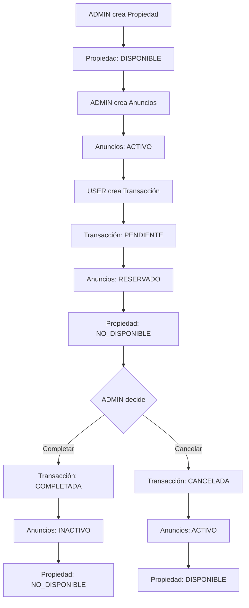

# Red Atlas Express API

[](https://github.com/your-org/red-atlas-express)
[](./coverage)
[](https://www.typescriptlang.org/)
[](./LICENSE)

## Overview

Red Atlas Express es una API REST robusta para gestión de propiedades inmobiliarias, desarrollada con TypeScript, Express, TypeORM y PostgreSQL con PostGIS. El sistema maneja el ciclo completo de transacciones inmobiliarias desde la creación de propiedades hasta la finalización de operaciones comerciales.

### Características Principales

- **Multi-tenant**: Aislamiento completo de datos por inquilino
- **Geoespacial**: Búsquedas por proximidad con PostGIS
- **Cache inteligente**: Redis con invalidación automática
- **Autenticación JWT**: Tokens de acceso y refresh
- **Paginación cursor-based**: Escalable para grandes datasets
- **Testing completo**: Unitarios y performance

### Arquitectura

```
┌─────────────────┐    ┌─────────────────┐    ┌─────────────────┐
│   Controllers   │───▶│    Services     │───▶│  Repositories   │
│  (HTTP Layer)   │    │ (Business Logic)│    │  (Data Access)  │
└─────────────────┘    └─────────────────┘    └─────────────────┘
         │                       │                       │
         ▼                       ▼                       ▼
┌─────────────────┐    ┌─────────────────┐    ┌─────────────────┐
│   Middlewares   │    │  Cache Service  │    │   PostgreSQL    │
│ (Auth, Errors)  │    │     (Redis)     │    │   + PostGIS     │
└─────────────────┘    └─────────────────┘    └─────────────────┘
```


## Flujo de Negocio

### Entidades y Roles

**Entidades principales:**
- **Propiedades**: Inmuebles con ubicación geoespacial
- **Anuncios**: Ofertas de venta/alquiler sobre propiedades
- **Transacciones**: Operaciones comerciales entre usuarios

**Roles del sistema:**
- **ADMIN**: Gestiona propiedades y anuncios, controla transacciones
- **USER**: Crea transacciones sobre anuncios disponibles

**Validaciones de integridad:**
- No se pueden crear anuncios en propiedades `NO_DISPONIBLE`
- No se pueden crear transacciones en anuncios `INACTIVO` o `RESERVADO`

### Ciclo de Estados



### Reglas de Estado

1. **Creación de Transacción (USER)**:
   - **Validación**: Solo anuncios en estado `ACTIVO` (no `RESERVADO` ni `INACTIVO`)
   - **Validación**: No debe existir transacción `PENDIENTE` previa
   - Transacción → `PENDIENTE`
   - Todos los anuncios de la propiedad → `RESERVADO`
   - Propiedad → `NO_DISPONIBLE`

2. **Completar Transacción (ADMIN)**:
   - **Validación**: Solo transacciones en estado `PENDIENTE`
   - Transacción → `COMPLETADA`
   - Todos los anuncios → `INACTIVO`
   - Propiedad permanece `NO_DISPONIBLE`

3. **Cancelar Transacción (ADMIN)**:
   - **Validación**: Solo transacciones en estado `PENDIENTE`
   - Transacción → `CANCELADA`
   - Todos los anuncios → `ACTIVO`
   - Propiedad → `DISPONIBLE`

## Requisitos Previos

| Herramienta | Versión Mínima | Propósito |
|-------------|----------------|-----------|
| Node.js | 18.x | Runtime de JavaScript |
| npm | 9.x | Gestor de paquetes |
| Docker | 20.x | Contenedores |
| Docker Compose | 2.x | Orquestación |
| PostgreSQL | 14.x | Base de datos principal |
| PostGIS | 3.3.x | Extensión geoespacial |
| Redis | 7.x | Cache y sesiones |

## Configuración

### Variables de Entorno

| Variable | Descripción | Obligatoria | Ejemplo |
|----------|-------------|-------------|---------|
| `NODE_ENV` | Entorno de ejecución | ✅ | `development` |
| `PORT` | Puerto del servidor | ✅ | `3000` |
| `DB_HOST` | Host de PostgreSQL | ✅ | `localhost` |
| `DB_PORT` | Puerto de PostgreSQL | ✅ | `5432` |
| `DB_USERNAME` | Usuario de base de datos | ✅ | `postgres` |
| `DB_PASSWORD` | Contraseña de base de datos | ✅ | `password` |
| `DB_NAME` | Nombre de la base de datos | ✅ | `red_atlas_db` |
| `JWT_SECRET` | Clave secreta para JWT | ✅ | `your-secret-key` |
| `JWT_EXPIRES_IN` | Expiración del token | ✅ | `15m` |
| `REFRESH_TOKEN_SECRET` | Clave para refresh tokens | ✅ | `your-refresh-secret` |
| `REFRESH_TOKEN_EXPIRES_IN` | Expiración refresh token | ✅ | `7d` |
| `REDIS_HOST` | Host de Redis | ✅ | `localhost` |
| `REDIS_PORT` | Puerto de Redis | ✅ | `6379` |
| `REDIS_DB` | Base de datos Redis | ✅ | `0` |
| `REDIS_PASSWORD` | Contraseña de Redis | ❌ | `` |
| `SEED_BATCH_SIZE` | Tamaño de lote para seeds | ✅ | `5000` |

### Archivo .env

Copia el archivo de ejemplo y configura las variables:

```bash
cp .env.example .env
# Edita .env con tus valores específicos
```

## Cómo Levantar el Proyecto con Docker

### 1. Levantar Servicios de Infraestructura

```bash
# Levantar PostgreSQL y Redis
npm run docker:up

# Verificar que los servicios estén corriendo
docker-compose ps
```

### 2. Configurar Base de Datos

```bash
# Ejecutar migraciones
npm run migration:run

# Generar datos de ejemplo (100k propiedades, 200k anuncios, 150k transacciones)
npm run seed:production
```

### 3. Iniciar la Aplicación

```bash
# Desarrollo con hot-reload
npm run dev

# En otra terminal, iniciar el worker de imports
# Por cuestiones de desarrollo al inciar se borran los mock-sqs-queue por lo tanto inicia de 0
# en caso de que corras un sqs y el worker este apagado luego cuando inicie las borrara
# Solo en modo dev
npm run import:worker

# Producción
npm run build && npm start
```

### Servicios y Puertos

| Servicio | Puerto Host | Puerto Contenedor | Descripción |
|----------|-------------|-------------------|-------------|
| API | 3001 | - | Aplicación principal |
| PostgreSQL | 5439 | 5432 | Base de datos con PostGIS |
| Redis | 6381 | 6379 | Cache y sesiones |

### Comandos Útiles

```bash
# Ver logs de PostgreSQL
npm run docker:logs

# Reiniciar servicios
docker-compose restart

# Limpiar volúmenes (⚠️ elimina datos)
docker-compose down -v
```

## Base de Datos

### Migraciones

```bash
# Ejecutar migraciones pendientes
npm run migration:run

# Revertir última migración
npm run migration:revert

# Verificar estado de migraciones
npm run typeorm migration:show
```

### Seeds y Datos de Ejemplo

```bash
# Dataset completo de producción (idempotente)
npm run seed:production

# Verificar datos generados
psql -d red_atlas_db -c "
SELECT 
  (SELECT COUNT(*) FROM propiedades) as propiedades,
  (SELECT COUNT(*) FROM anuncios) as anuncios, 
  (SELECT COUNT(*) FROM transacciones) as transacciones;
"
```

**Dataset generado:**
- 100,000 propiedades distribuidas en Argentina y Uruguay
- 200,000 anuncios con precios realistas por ciudad
- 150,000 transacciones con estados distribuidos
- Coordenadas PostGIS en bounding boxes realistas
- UUIDs determinísticos para reproducibilidad


## Tests

### Tests Unitarios

```bash
# Ejecutar todos los tests unitarios
npm run test:unit

```

**Cobertura actual:**
- ✅ Servicios: Lógica de negocio, validaciones, CRUD
- ✅ Controladores: Manejo de requests, control de acceso
- ✅ Utilidades: Cache, paginación, manejo de errores
- ✅ Middleware: Autenticación, validación, formateo

## Performance / Carga

### Herramienta: Autocannon

```bash
# Instalar dependencias de performance
cd performance && npm install

# Test realista completo
npm run test:realistic
```

## Estrategia de Invalidación de Cache Redis

### Arquitectura de Cache Implementada

El sistema utiliza una **estrategia de invalidación inteligente por patrones** que garantiza consistencia de datos mientras maximiza el rendimiento.

#### 1. Estructura de Claves

```typescript
// Patrones de claves utilizados:
{entity}:{tenantId}:{id}                    // Entidad específica
{entity}_search:{tenantId}:{filtros_hash}   // Búsquedas con filtros  
{entity}s:{tenantId}:{params_hash}          // Listados paginados

// Ejemplos reales:
"property:tenant-123:prop-456"              // Propiedad específica
"properties_search:tenant-123:_status_disponible_tipo_casa_"  // Búsqueda filtrada
"listings_search:tenant-123:_minPrice_100000_status_activo_"  // Anuncios filtrados
```

#### 2. Método `invalidateEntity()` - Núcleo de la Estrategia

```typescript
// En CacheService.invalidateEntity()
async invalidateEntity(entityName: string, tenantId: string, id?: string): Promise<void> {
  const patterns = [
    `${entityName}s:${tenantId}*`,        // Listados generales
    `${entityName}s_search:${tenantId}*`  // Búsquedas con filtros
  ];
  
  if (id) {
    patterns.push(`${entityName}:${tenantId}:${id}`);  // Entidad específica
  }
  
  await Promise.all(patterns.map(pattern => this.invalidate(pattern)));
}
```

#### 3. Invalidación por Operación

| Operación | Método Service | Patrones Invalidados | Razón |
|-----------|----------------|---------------------|-------|
| `POST /properties` | `create()` | `property:tenant*` | Nueva propiedad afecta listados |
| `PUT /properties/:id` | `update()` | `property:tenant:id`, `property:tenant*` | Cambios afectan entidad y búsquedas |
| `DELETE /properties/:id` | `delete()` | `property:tenant:id`, `property:tenant*` | Eliminación afecta todo |
| `POST /listings` | `create()` | `listing:tenant*` | Nuevo anuncio afecta búsquedas |
| `POST /transactions` | `create()` | `transaction:tenant*` | Nueva transacción |
| `PATCH /transactions/:id/complete` | `complete()` | `transaction:tenant*` | Cambio de estado crítico |

#### 4. TTL Diferenciado por Criticidad

```typescript
// Configuración de TTL implementada:
const CACHE_TTL = {
  ENTITY_DETAIL: 600,      // 10min - Propiedades individuales (datos estables)
  SEARCH_RESULTS: 300,     // 5min - Búsquedas de propiedades
  LISTINGS_SEARCH: 120,    // 2min - Búsquedas de anuncios (más dinámicos)
  TRANSACTIONS: 30,        // 30s - Transacciones (datos críticos)
};
```

### Monitoreo de Cache

```bash
# Ver hit rate de Redis
redis-cli INFO stats | grep keyspace_hits

# Ver claves por tenant
redis-cli KEYS "properties:tenant-123*"

# Limpiar cache específico
redis-cli DEL $(redis-cli KEYS "properties_search:tenant-123*")
```

## Sistema de Importación Masiva

### Arquitectura del Worker

El sistema utiliza un **worker asíncrono** para procesar imports de CSV de forma escalable:

```
┌─────────────────┐    ┌─────────────────┐    ┌─────────────────┐
│   API Server    │───▶│   SQS Queue     │───▶│  Import Worker  │
│ (Upload CSV)   │    │  (Batches)     │    │ (Process DB)   │
└─────────────────┘    └─────────────────┘    └─────────────────┘
```

### Flujo de Procesamiento

1. **Upload CSV** (API Server):
   - Calcula hash SHA-256 del archivo
   - Verifica duplicados por hash
   - Procesa CSV en streaming
   - Divide en batches de 1000 registros
   - Envía batches a cola SQS

2. **Worker Processing**:
   - Consume mensajes de la cola
   - Aplica deduplicación por mensaje
   - Inserta registros en PostgreSQL
   - Maneja errores individuales
   - Actualiza progreso en tiempo real

### Endpoints de Import

| Endpoint | Método | Descripción | Rol |
|----------|---------|-------------|-----|
| `/api/imports` | POST | Subir CSV | ADMIN |
| `/api/imports/history` | GET | Historial | Cualquiera |
| `/api/imports/{id}` | GET | Estado | Cualquiera |

### Uso del Sistema

```http
POST /api/imports
Authorization: Bearer TOKEN
Content-Type: multipart/form-data

[Body: archivo CSV]
```

**Respuesta:**
```json
{
  "importId": "123e4567-e89b-12d3-a456-426614174000",
  "message": "Import started successfully"
}
```

**Consultar progreso:**
```http
GET /api/imports/123e4567-e89b-12d3-a456-426614174000
```

**Respuesta:**
```json
{
  "id": "123e4567-e89b-12d3-a456-426614174000",
  "filename": "properties-100k.csv",
  "status": "processing",
  "totalRows": 100000,
  "processedRows": 75000,
  "successRows": 74850,
  "errorRows": 150,
  "errors": [
    {
      "row": 1523,
      "field": "superficie",
      "message": "Superficie must be a positive number"
    }
  ]
}
```

### Formato CSV Requerido

```csv
title,tipo,superficie,pais,ciudad,calle,altura,ambientes,latitude,longitude
Casa en Palermo,casa,120,Argentina,Buenos Aires,Av. Santa Fe,1234,3,-34.5755,-58.4370
Departamento Moderno,departamento,85,Argentina,Buenos Aires,Corrientes,5678,2,-34.6037,-58.3816
```

**Campos obligatorios:** `title`, `tipo`, `superficie`, `pais`, `ciudad`, `calle`, `altura`  
**Campos opcionales:** `ambientes`, `latitude`, `longitude`  
**Tipos válidos:** `casa`, `departamento`, `oficina`, `local`, `terreno`, `galpon`

### Características del Worker

- **Deduplicación**: Por hash de archivo y por mensaje individual
- **Reintentos**: Máximo 2 reintentos por batch fallido
- **Dead Letter Queue**: Mensajes fallidos se almacenan en `mensajes_con_error`
- **Resiliente**: Una fila errónea no detiene el import completo
- **Escalable**: Procesa 100k+ registros eficientemente
- **Limpieza automática**: Al reiniciar, limpia cola y memoria

### Iniciar el Worker

```bash
# Desarrollo
npm run import:worker

# Producción (con PM2)
pm2 start "npm run import:worker" --name "import-worker"
```

**Output esperado:**
```
🔗 Database connected for import worker
🧹 Cleared SQS queue and processed messages
🧹 Queue cleared on startup
🚀 Import worker started
📥 Mock SQS: Received 10 messages
📊 Processing Stats: { processed: 1000, errors: 0, retries: 0 }
```

## Cómo Acceder a Swagger UI

### Configuración Automática

La documentación Swagger UI está configurada automáticamente y se sirve en `/docs`:

```bash
# 1. Levantar la aplicación
npm run dev

# 2. Abrir en el navegador
open http://localhost:3001/docs
```

### Uso con Autenticación

```bash
# 1. Hacer login para obtener token
curl -X POST http://localhost:3001/api/auth/login \
  -H "Content-Type: application/json" \
  -d '{"email": "admin@argentina.com", "password": "password123"}'

# 2. En Swagger UI, hacer clic en "Authorize"
# 3. Ingresar: Bearer <tu-access-token>
# 4. Ahora puedes probar endpoints protegidos
```

## Escalabilidad a 1M+ Registros

### Dataset Actual vs Objetivo

**Configuración Actual (Script de Seeds):**
- 100,000 propiedades (50k por tenant)
- 200,000 anuncios (100k por tenant)
- 150,000 transacciones (75k por tenant)
- 2 tenants con datos geográficos realistas
- Inserción por lotes de 5,000 registros

**Objetivo de Escalabilidad:**
- 1M+ propiedades
- 2M+ anuncios
- 1.5M+ transacciones
- Múltiples tenants

### Estrategia de Particionamiento

#### 1. Particionamiento por Tenant (Hash)

```sql
-- Crear tabla particionada por tenant_id
CREATE TABLE propiedades_partitioned (
    LIKE propiedades INCLUDING ALL
) PARTITION BY HASH (tenant_id);

-- Crear 4 particiones para distribución uniforme
CREATE TABLE propiedades_p0 PARTITION OF propiedades_partitioned
    FOR VALUES WITH (modulus 4, remainder 0);
CREATE TABLE propiedades_p1 PARTITION OF propiedades_partitioned
    FOR VALUES WITH (modulus 4, remainder 1);
-- ... continuar para p2, p3
```

#### 2. Particionamiento Híbrido para Transacciones

```sql
-- Particionamiento por fecha + sub-particionamiento por tenant
CREATE TABLE transacciones_partitioned (
    LIKE transacciones INCLUDING ALL
) PARTITION BY RANGE (created_at);

-- Particiones mensuales
CREATE TABLE transacciones_2024_01 PARTITION OF transacciones_partitioned
    FOR VALUES FROM ('2024-01-01') TO ('2024-02-01');

-- Sub-particionamiento por tenant
ALTER TABLE transacciones_2024_01 PARTITION BY HASH (tenant_id);
```

### Plan de Índices Optimizados

#### Índices por Entidad

```sql
-- Propiedades: Búsquedas frecuentes
CREATE INDEX CONCURRENTLY idx_propiedades_tenant_status 
    ON propiedades (tenant_id, status) WHERE deleted_at IS NULL;
CREATE INDEX CONCURRENTLY idx_propiedades_tenant_ciudad_tipo 
    ON propiedades (tenant_id, ciudad, tipo);
CREATE INDEX CONCURRENTLY idx_propiedades_location_gist 
    ON propiedades USING GIST (location);  -- PostGIS espacial

-- Anuncios: Filtros de precio y estado
CREATE INDEX CONCURRENTLY idx_anuncios_tenant_status 
    ON anuncios (tenant_id, status);
CREATE INDEX CONCURRENTLY idx_anuncios_tenant_price 
    ON anuncios (tenant_id, price) WHERE status = 'activo';
CREATE INDEX CONCURRENTLY idx_anuncios_property_id 
    ON anuncios (property_id);

-- Transacciones: Estados y fechas
CREATE INDEX CONCURRENTLY idx_transacciones_tenant_status 
    ON transacciones (tenant_id, status);
CREATE INDEX CONCURRENTLY idx_transacciones_created_desc 
    ON transacciones (created_at DESC);
CREATE INDEX CONCURRENTLY idx_transacciones_user_id 
    ON transacciones (user_id);
```

#### Script de Índices por Partición

```sql
-- Función para crear índices en todas las particiones
CREATE OR REPLACE FUNCTION create_partition_indexes(table_name text)
RETURNS void AS $$
DECLARE
    partition_name text;
BEGIN
    FOR partition_name IN 
        SELECT schemaname||'.'||tablename 
        FROM pg_tables 
        WHERE tablename LIKE table_name || '_p%'
    LOOP
        EXECUTE format('CREATE INDEX CONCURRENTLY IF NOT EXISTS %I_tenant_status_idx 
                       ON %s (tenant_id, status)', partition_name, partition_name);
        
        IF table_name = 'propiedades' THEN
            EXECUTE format('CREATE INDEX CONCURRENTLY IF NOT EXISTS %I_location_gist_idx 
                           ON %s USING GIST (location)', partition_name, partition_name);
        END IF;
    END LOOP;
END;
$$ LANGUAGE plpgsql;
```

### Configuración PostgreSQL para 1M+ Registros

```ini
# postgresql.conf para servidor con 32GB RAM
shared_buffers = 8GB
effective_cache_size = 24GB
work_mem = 512MB
maintenance_work_mem = 2GB

# Conexiones y paralelismo
max_connections = 300
max_worker_processes = 16
max_parallel_workers = 12

# PostGIS y extensiones
max_locks_per_transaction = 512
shared_preload_libraries = 'pg_stat_statements,auto_explain'

# Autovacuum optimizado
autovacuum_max_workers = 6
autovacuum_naptime = 30s
```

### Migración Gradual (Zero Downtime)

```bash
# 1. Backup completo
pg_dump -Fc -Z9 red_atlas_db > backup_pre_partition_$(date +%Y%m%d).dump

# 2. Crear tablas particionadas
psql -f create_partitioned_tables.sql

# 3. Migrar datos por lotes (script basado en seed.ts)
npm run migrate:to-partitions

# 4. Intercambiar tablas
psql -c "BEGIN; ALTER TABLE propiedades RENAME TO propiedades_old; 
         ALTER TABLE propiedades_new RENAME TO propiedades; COMMIT;"
```

### Monitoreo de Particiones

```sql
-- Tamaño por partición
SELECT 
    tablename,
    pg_size_pretty(pg_total_relation_size(tablename)) as size
FROM pg_tables 
WHERE tablename LIKE 'propiedades_p%' 
ORDER BY pg_total_relation_size(tablename) DESC;

-- Distribución de datos
SELECT 
    tableoid::regclass as partition_name,
    COUNT(*) as row_count
FROM propiedades 
GROUP BY tableoid;
```

### Hardware Recomendado

| Escala | CPU | RAM | Storage | Network |
|--------|-----|-----|---------|----------|
| 1M registros | 8 cores | 32GB | NVMe SSD 1TB | 1Gbps |
| 10M+ registros | 16+ cores | 64GB+ | NVMe RAID 10, 2TB+ | 10Gbps |

### Queries Optimizadas para Particiones

```sql
-- Búsqueda multi-filtro (usa partition pruning)
SELECT p.*, a.price
FROM propiedades p
JOIN anuncios a ON p.id = a.property_id
WHERE p.tenant_id = '550e8400-e29b-41d4-a716-446655440010'  -- Partition pruning
  AND p.ciudad = 'Buenos Aires'
  AND p.tipo = 'departamento'
  AND p.status = 'disponible'
LIMIT 20;

-- Búsqueda geográfica con PostGIS
SELECT p.*, ST_Distance(p.location, ST_Point(-58.3816, -34.6037)) as distancia
FROM propiedades p
WHERE p.tenant_id = '550e8400-e29b-41d4-a716-446655440010'
  AND ST_DWithin(p.location, ST_Point(-58.3816, -34.6037), 1000)
ORDER BY p.location <-> ST_Point(-58.3816, -34.6037)
LIMIT 10;
```

**Guía completa:** [docs/escalado.md](./docs/escalado.md)

## Locks Distribuidos con Redis

### Casos de Uso Implementados

El sistema utiliza **locks distribuidos con Redis** para prevenir condiciones de carrera en operaciones críticas del módulo de anuncios:

#### 1. Actualización de Estado por Propiedad

```typescript
// Previene que múltiples transacciones reserven la misma propiedad simultáneamente
async updateStatusByPropertyId(propertyId: string, status: AnuncioStatus, tenantId: string) {
  const lockKey = `property_status_lock:${tenantId}:${propertyId}`;
  
  await this.lockService.withLock(lockKey, 10, async () => {
    await this.anuncioRepository.updateStatusByPropertyId(propertyId, status, tenantId);
    await this.cacheService.invalidateEntity('listing', tenantId);
  });
}
```

**Escenario crítico**: Cuando un USER crea una transacción, todos los anuncios de la propiedad deben cambiar a `RESERVADO` atómicamente.

#### 2. Creación de Anuncios

```typescript
// Previene anuncios duplicados del mismo tipo para una propiedad
async create(data: Partial<Anuncio>) {
  const lockKey = `create_listing_lock:${data.tenantId}:${data.propertyId}`;
  
  return await this.lockService.withLock(lockKey, 15, async () => {
    // Verificar que no exista anuncio activo del mismo tipo
    const existingListings = await this.findByPropertyId(data.propertyId!, data.tenantId!);
    const activeOfSameType = existingListings.find(a => 
      a.tipo === data.tipo && a.status === AnuncioStatus.ACTIVO
    );
    
    if (activeOfSameType) {
      throw new ValidationError(`Ya existe un anuncio activo de ${data.tipo} para esta propiedad`);
    }
    
    return await this.anuncioRepository.create(data);
  });
}
```

**Escenario crítico**: Evita que se creen múltiples anuncios de "venta" o "alquiler" para la misma propiedad.

#### 3. Actualización de Precio/Estado

```typescript
// Lock condicional solo para campos críticos
async update(id: string, data: Partial<Anuncio>, tenantId: string) {
  if (data.price !== undefined || data.status !== undefined) {
    const lockKey = `update_listing_lock:${tenantId}:${id}`;
    
    return await this.lockService.withLock(lockKey, 10, async () => {
      return await this.anuncioRepository.update(id, data, tenantId);
    });
  }
  
  // Otros campos sin lock
  return await this.anuncioRepository.update(id, data, tenantId);
}
```

**Escenario crítico**: Actualizaciones concurrentes de precio durante negociaciones.

### Implementación del Lock Service

```typescript
export class LockService {
  async withLock<T>(key: string, ttlSeconds: number, operation: () => Promise<T>): Promise<T> {
    const lockValue = await this.acquireLock(key, ttlSeconds);
    if (!lockValue) {
      throw new Error(`Could not acquire lock for key: ${key}`);
    }

    try {
      return await operation();
    } finally {
      await this.releaseLock(key, lockValue);
    }
  }

  private async acquireLock(key: string, ttlSeconds: number): Promise<string | null> {
    const lockValue = `${Date.now()}-${Math.random()}`;
    const result = await redis.set(key, lockValue, 'PX', ttlSeconds * 1000, 'NX');
    return result === 'OK' ? lockValue : null;
  }

  private async releaseLock(key: string, lockValue: string): Promise<boolean> {
    const script = `
      if redis.call("get", KEYS[1]) == ARGV[1] then
        return redis.call("del", KEYS[1])
      else
        return 0
      end
    `;
    return await redis.eval(script, 1, key, lockValue) === 1;
  }
}
```

### Beneficios de esta Estrategia

1. **Consistencia de Datos**: Previene estados inconsistentes en operaciones concurrentes
2. **Multi-tenant Seguro**: Locks aislados por `tenantId`
3. **TTL Automático**: Los locks expiran automáticamente (10-15 segundos)
4. **Atomic Release**: Script Lua garantiza liberación atómica
5. **Granularidad Fina**: Locks específicos por recurso, no globales

### Monitoreo de Locks

```bash
# Ver locks activos
redis-cli KEYS "*_lock:*"

# Ver locks por tenant
redis-cli KEYS "*_lock:tenant-123:*"

# Limpiar locks expirados manualmente (si es necesario)
redis-cli EVAL "return redis.call('del', unpack(redis.call('keys', ARGV[1])))" 0 "*_lock:*"
```

### Casos de Error y Recuperación

- **Lock no disponible**: La operación falla inmediatamente con error claro
- **TTL expiration**: Los locks se liberan automáticamente después del TTL
- **Redis unavailable**: Las operaciones fallan rápidamente sin bloquear la aplicación
- **Process crash**: Los locks expiran automáticamente por TTL